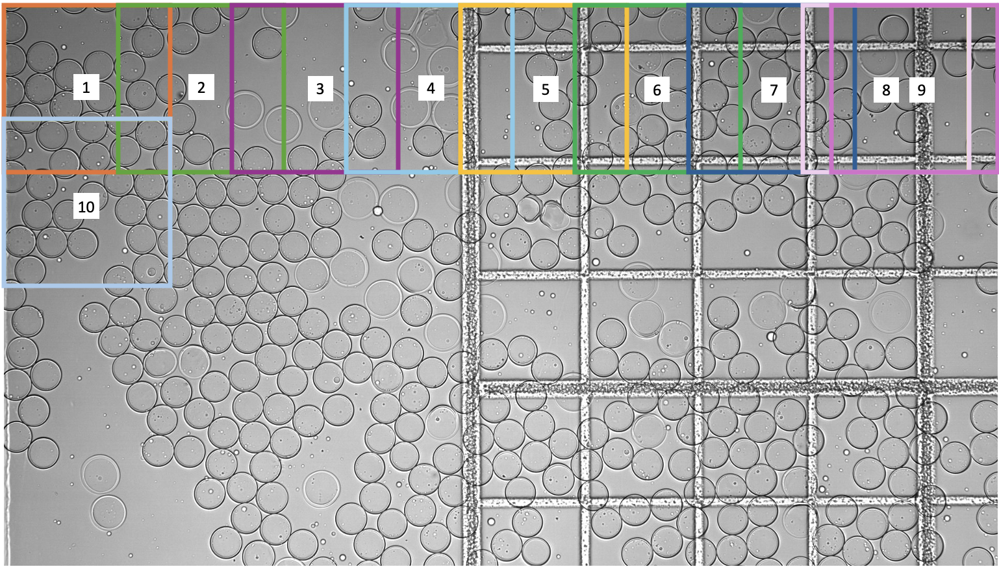
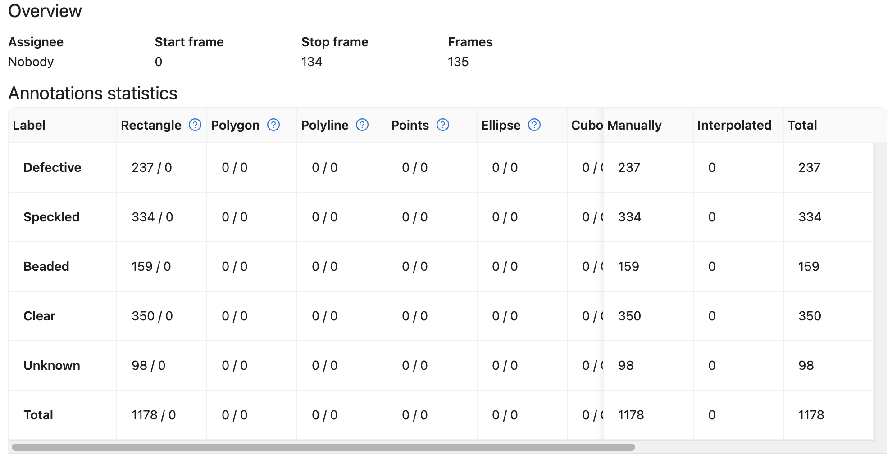
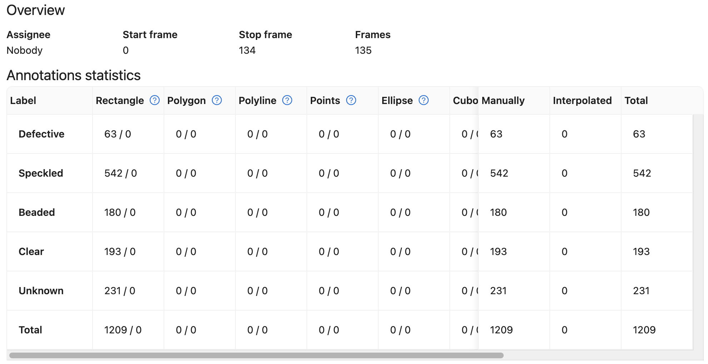
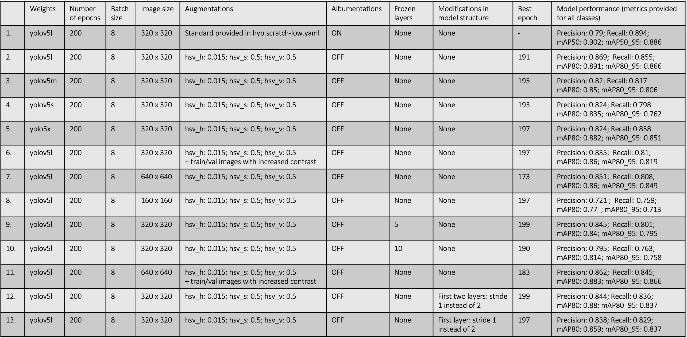
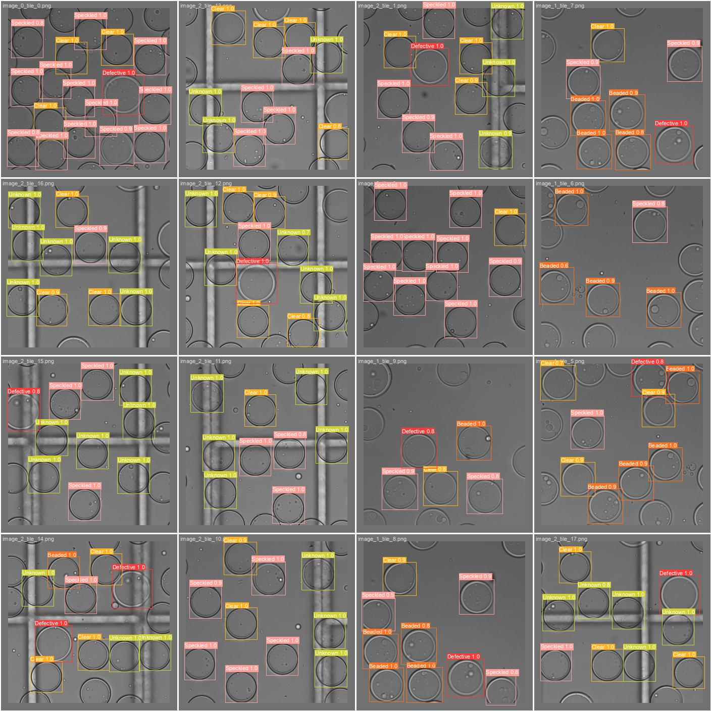
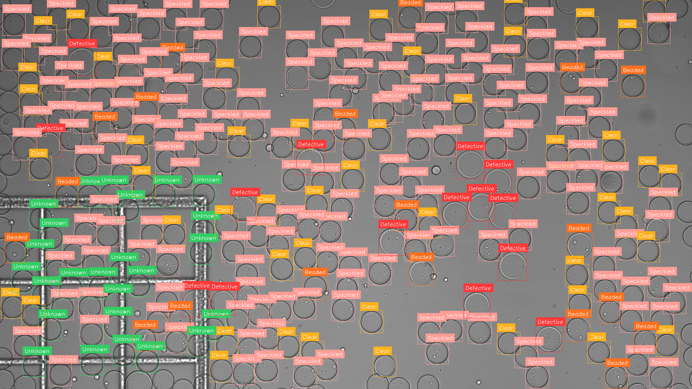
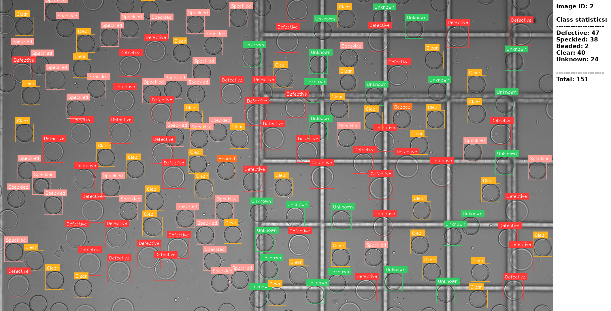

# particles
## Particle detection and classification using YOLOv5

#### Data generation
The raw data consists of bright-field microscopy images with dimensions of (1080, 1920, 3). To increase the number of images and reduce the number of objects per image, the raw microscopy images were split into 320 x 320 tiles with some overlap to minimize the number of split and undetected particles (refer to Figure 1). For the training dataset, random tiles were selected from the raw training microscopy images, whereas for the validation set, all tiles generated from the corresponding validation images were used. Specifically, 135 tiles from 11 images were used for model training, and 135 tiles from 3 images were used for validation. The code for tile generation is provided in `Tile_Generation/getting_tiles.ipynb` notebook.


Figure 1. Tile generation from microscopy image. Using a sliding window of size 320 x 320 pixels and a stride of 220 pixels (except for the last tile in each row and column), 45 tiles were generated from each image.

#### Data annotation
After generating the training and validation tiles, they were annotated using the CVAT tool. A total of 5 classes were created: ["Defective", "Speckled", "Beaded", "Clear", "Unknown"]. A summary of the training and validation data annotation is provided below.


Figure 2. Annotated data for training process.


Figure 3. Annotated data for validation process.

#### YOLO model training
For the object detection and classification task, YOLOv5 from the Ultralytics GitHub repository was used. Due to the limited amount of data, transfer learning was applied, conducting 200 epochs of training on top of the pre-trained model (after the training process the best model instead of last model was selected).
Various experiments were conducted to evaluate the hyperparameter configurations which would yield the best results, including model size (small, medium, large, extra large), image size, augmentations, the first layers stride changes to avoid drastic image reduction, etc.
Among the various experiments performed, the best results were obtained using the following hyperparameters and settings:
* image_size: (320, 320)
* batch_size: 8
* model_size: yolov5l
* augmentations: hsv_h: 0.015; hsv_s: 0.5; hsv_v: 0.5
* albumentations: OFF
* frozen layers: NONE 

Note that all other parameters remained the same. Summary of the performed experiments is provided below:



Figure 4. A batch of validation tiles with predicted bounding boxes and classes. The results were obtained from the second experiment listed in the table above.

#### Image reassembly from tiles
Although the training and validation processes were performed using tiles, image-wide results will be required during inference. To achieve this, after obtaining model predictions, the tiles were reconstructed into the original image, and the labels/predictions were processed to match the original image format. Before conducting this workflow on the testing dataset, this process was optimized on the validation dataset. The detailed steps are listed below:
1) Load validation tiles and labels into a dictionary.
2) Apply the YOLOv5 model on the tiles to get predictions.
3) Process the predictions: remove bounding boxes with a low objectness score (threshold 0.8), get the class index with the highest probability for each box, convert [x_center, y_center, width, height] to [x_min, y_min, x_max, y_max], and return [x_min, y_min, x_max, y_max, confidence, class_index].
4) Add processed predictions into the existing dictionary. Data standard is outlined below:
```python
tiles_with_labels_predictions = {
    "image_0_tile_0": {
        "tile": np.array([...]),  # numpy array representing the tile
        "labels": np.array([...]),  # numpy array of labels
        "predictions": np.array([...])  # numpy array of predictions
    },
    "image_0_tile_1": {
        "tile": np.array([...]),
        "labels": np.array([...]),
        "predictions": np.array([...])
    },
    # more tiles...
}
```
5) Reconstruct the image from tiles and remove overlapping labels/predictions using NMS. After this step, each reconstructed image with plotted labels and predictions is saved to the output directory. In addition, all information is saved in a JSON file.
6) Use the information from the JSON file to calculate precision and recall for each image. Additionally, provide the counts of each assigned class.

Image reconstruction code is provided in the `Validation_Detection` folder `valid_custom.ipynb` notebook. Note that all functions used for this part are located in the `util` folder.


Figure 5. Example of a reconstructed image with corresponding predictions.

#### Running model inference
To apply the trained and validated model for routine particle detection and classification tasks, use files provided in the `Validation_Detection` folder, specifically `detection.ipynb`.


Figure 6. Example of the final detection output with added statistics.